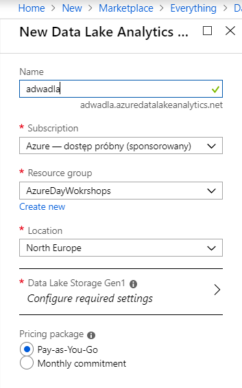
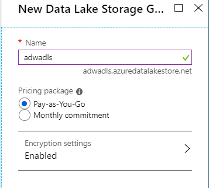
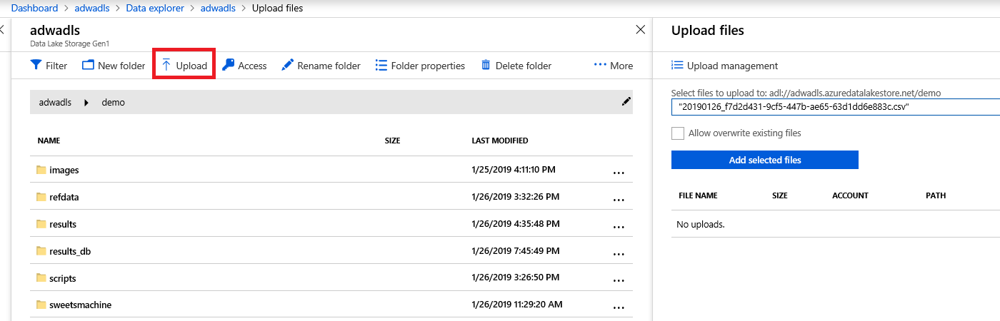
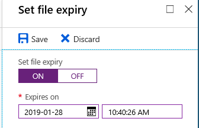

# Zadanie 1

## Utworzenie usługi Azure Data Lake Analytics

- Uwtórz usługę Azure Data Lake Analytics 
  - Azure->Nowy-> Data Lake Analytics ->Uwtórz ( Usługa Azure Data Lake Analytics wymaga Azure Data Lake Store, jeśli ADLS został utworzony wcześniej może zostać wybrany istniejący, jeśli nie należy utworzyć ADLS podczas tworzenia ADLA)

Po utworzeniu usługi przejść do usługi ADLS i otwórz Data Explorer.

Następnie (stwórz folder -opcjonalnie) i skopiuj wybrany plik

Dla skopiowanego pliku ustaw Expiry Date

