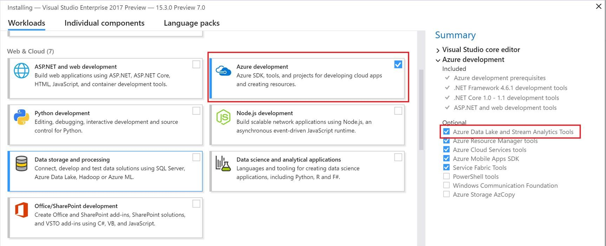
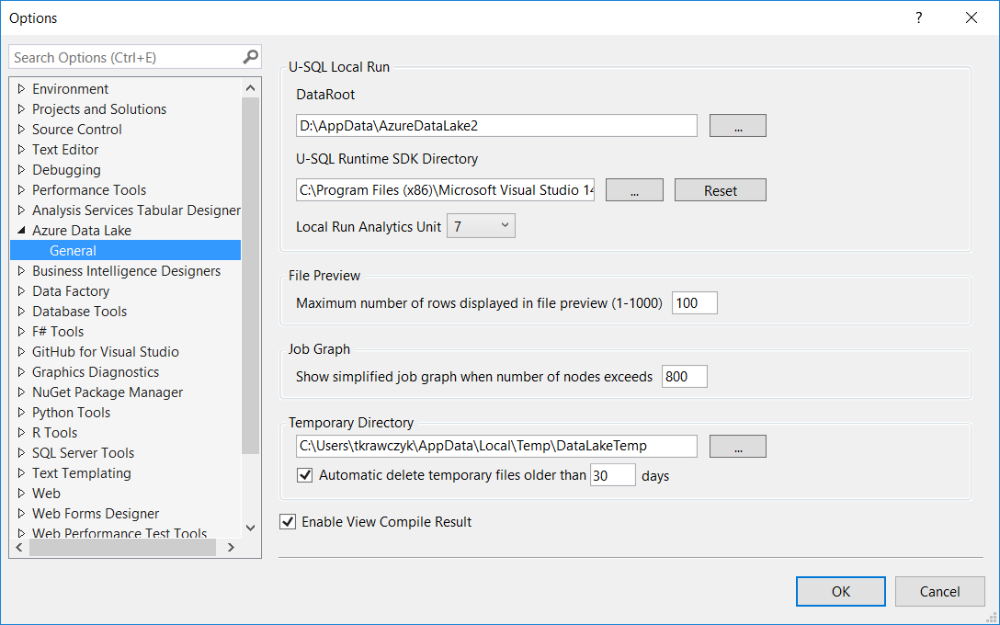
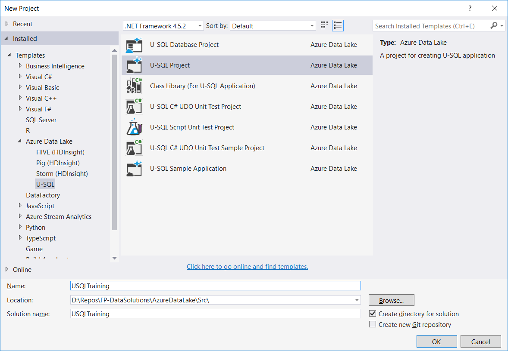
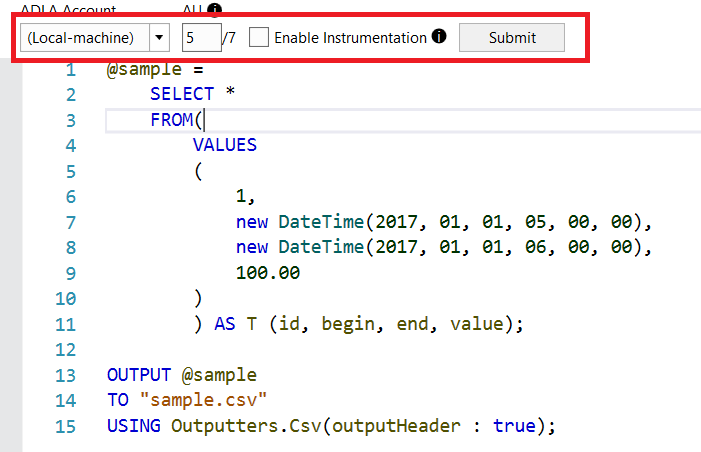

# Zadanie 2

W przypadku Visual Studio 2013 lub 2015 należy zainstalować dodatek 

[Microsoft Azure Data Lake and Stream Analytics Tools for Visual Studio]: https://www.microsoft.com/en-us/download/details.aspx?id=49504

w przypadku Visual Studio 2017 należy wybrać podczas instalacji opcję Azure Development

Po instalacja należy dokonać konfiguracji dodatku (ustawić scieżki oraz ilość zasobów do uruchamiania lokalnie) **Visual Studio->Tools->Options and Settings**

Następnie należy utworzyć projekt U-SQL

Po utworzeniu projektu należy dodać/(edytować skrypt Scritp1.usql) skrypt U-SQL oraz uruchomić skrypt lokalnie.

