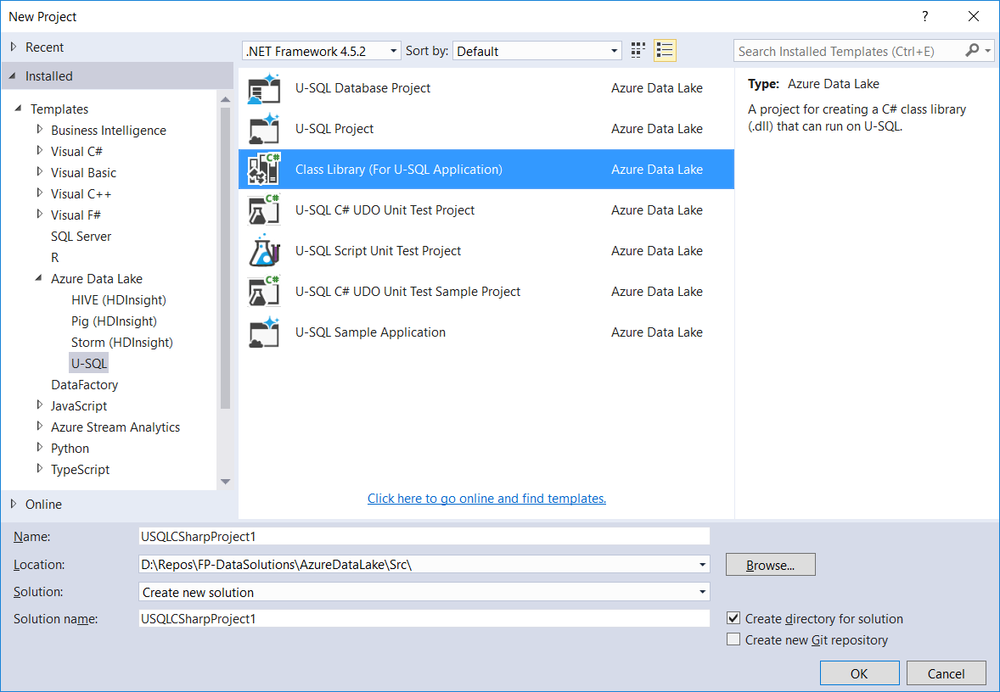

# Zadanie 6

W pierwszym kroku należy stworzyć projekt Class Library (for U-SQL Application)



Następnie w projekcie należy stworzyć klasę ze statyczną metoda

```c#
 public static string GetInstalledApps()
        {
            var sb = new StringBuilder();
            ManagementObjectSearcher mos = new ManagementObjectSearcher("SELECT * FROM Win32_Product");
            foreach (ManagementObject mo in mos.Get())
            {
                sb.AppendLine(mo["Name"].ToString());
            }
            return sb.ToString();
        }
```

Po skompilowaniu projektu należy zarejestrować (na danej bazie danych) stworzone assembly (w przypadku rejestracji w chmurze Azure należy skopiować na ADLS)

```mssql
//D:\Repos\FP-DataSolutions\AzureDataLake\Src\USQLTraining\ADLAExt\bin\Debug\
DECLARE @AssemblyPath string = @"D:\\Repos\\FP-DataSolutions\\AzureDataLake\\Src\\USQLTraining\\ADLAExt\\bin\\Debug\\";
//DECLARE @AssemblyPath string = @"myAssemblies/";

DECLARE @AssemblyExt string = @AssemblyPath+"ADLAExt.dll";
USE [ADLUTraining];
DROP ASSEMBLY IF EXISTS ADLAExt;
CREATE ASSEMBLY ADLAExt FROM @AssemblyExt;
```

Następnie tworzymy skrypt U-SQL i uruchamiamy go na Azure

```
USE DATABASE [ADLUTraining];
REFERENCE ASSEMBLY ADLAExt;
USING adlinfo = ADLAExt.Utils.VertextInfo;
DECLARE @expiry = new TimeSpan(0,5,0);

@ds =
    SELECT adlinfo.GetInfo() AS BasicInfo,
           adlinfo.GetFullInfo() AS FullInfo,  
           adlinfo.GetVMInfo()  AS VMInfo,
           adlinfo.GetDrivesInfo() AS Drives,
           adlinfo.GetInstalledApps() AS Apps,
           adlinfo.ListCurrentDir() AS Content,
           adlinfo.ListDrivesFiles("D:\\data") AS DDrive
    FROM(
        VALUES
        (
            "Info"
        ))
AS T(Info);

@adluinfo =
    SELECT FullInfo,BasicInfo
    FROM @ds;

OUTPUT @adluinfo
TO "/Demos/DC/ADLU/adluinfo.cvs"
EXPIRATION @expiry
USING Outputters.Csv();

@drivesinfo =
    SELECT Drives
    FROM @ds;

OUTPUT @drivesinfo
TO "/Demos/DC/ADLU/adlu_drivesinfo.cvs"
EXPIRATION @expiry
USING Outputters.Csv();

@apps =
    SELECT Apps
    FROM @ds;

OUTPUT @apps
TO "/Demos/DC/ADLU/adlu_apps.cvs"
EXPIRATION @expiry
USING Outputters.Csv();

@workingDir =
    SELECT Content
    FROM @ds;

OUTPUT @workingDir
TO "/Demos/DC/ADLU/adlu_workingDir.cvs"
EXPIRATION @expiry
USING Outputters.Csv();

@ddrive =
    SELECT DDrive
    FROM @ds;

OUTPUT @ddrive
TO "/Demos/DC/ADLU/adlu_dDrive.cvs"
EXPIRATION @expiry
USING Outputters.Csv();
```

