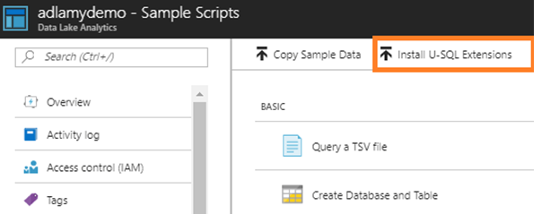
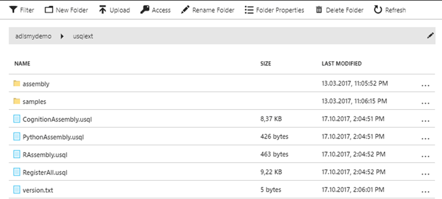

# Zadanie 7

W pierwszym kroku należy zarejestrować rozszerzenia dla U-SQL. Aby to zrobić należy z poziomu portalu Azure przejść do usługi Azure Data Lake Analytics. Następnie przejść do opcji **Sample Scripts** , a następnie do **Install U-SQL Extentions**



Po zainstalowaniu zainstalowaniu rozszerzeń na Azure Data Lake Store powinien powstać katalog usqlext.



W kolejnym kroku należy zarejestrować rozszerzenia. W tym celu należy uruchomić skrypt RegisterAll.usql (typowy job U-SQL ADLU=1). Rozszerzenia zostaną zarejestrowane na bazie master.

Następnie należy skopiować pliki, dla których chcemy wykonać przetwarzania na ADLS i uruchomić skrypt

```mssql
USE [master];
REFERENCE ASSEMBLY ImageCommon;
REFERENCE ASSEMBLY ImageTagging;

DECLARE @basePath string = @"/Images";
DECLARE @input string = @basePath + "/{FileName}";
DECLARE @output string = @basePath + @"/output/objects.csv";


///Extract images
@imgs =
    EXTRACT FileName string,
            ImgData byte[]
    FROM @input
    USING new Cognition.Vision.ImageExtractor();

//// Extract the number of objects on each image and tag them 
@objects =
    PROCESS @imgs 
    PRODUCE FileName,
            NumObjects int,
            Tags SQL.MAP<string, float?>
    READONLY FileName
    USING new Cognition.Vision.ImageTagger();

//// Transform to table:
///  FileName tag1
///  FileName tag2
///  FileName tag3

@objects =
    SELECT o.FileName,
           t.Tag,
           t.Conf
    FROM @objects AS o
         CROSS APPLY
             EXPLODE(o.Tags) AS t(Tag,Conf);

OUTPUT @objects
TO @output
ORDER BY FileName
USING Outputters.Csv(outputHeader:true);

```

