# Zadanie 8

## Tworzenie Service Principal

Aby mieć dostęp z poziomu ADF zarówno do ADLS jak i ADLA należy najpierw stworzyć Service Principal.

Aby dodać Service Principal z poziomu portalu przechodzimy do opcji **Azure Active Directory->App registrations->App registrations**

 

  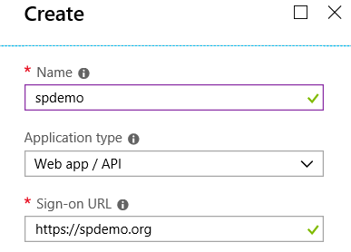

Po utworzeniu aplikacji skopiuj **Application ID** i przejdź do opcji **Settings** aby wygenerować klucz dostępu.

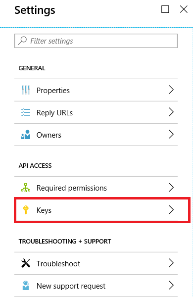

Następnie podaj nazwę klucza i czas obowiązywania. 

Po wygenerowaniu klucza zapisz go.

### Nadawanie uprawnień dla Service Principal do Azure Data Lake

Po stworzeniu SP przejdź do usługi Azure Data Lake Analytics, aby nadać uprawnienia dla stworzonego SP.

Następnie uruchom Wizarda dodawania nowego użytkownika.

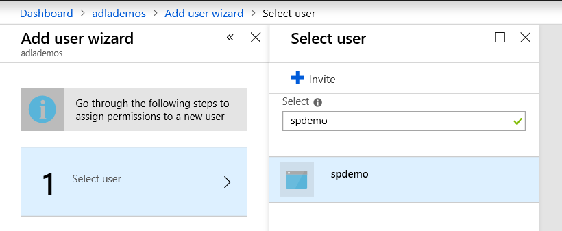

Wybierz:

-  rolę:Contributor 
- Select catalog permissions :Read and Write dla wszystkich obiektów
- Select file permissions: Read Write Execute oraz opcję This folder and all childern

Następnie Assign selected permissions i **Run**

 

 

## Tworzenie usługi Azure Data Factory

## 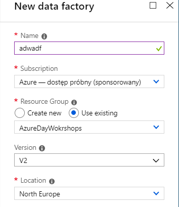

Aby utworzyć usługę Azure Data Factory należy podać unikaną nazwę np. **adwadf** , wybrać subskrypcję oraz Resource Group. Dodatkowo należy wybrać wersję -koniecznie V2 oraz lokalizację. Lokalizacja powinna być taka jak dla wcześniej tworzonych zasobów.

## Uruchamianie Designera

Aby uruchomić designer należy przejść do wcześniej stworzonej usługi ADF na portalu Azure a następnie wybrać opcję Author and Monitor

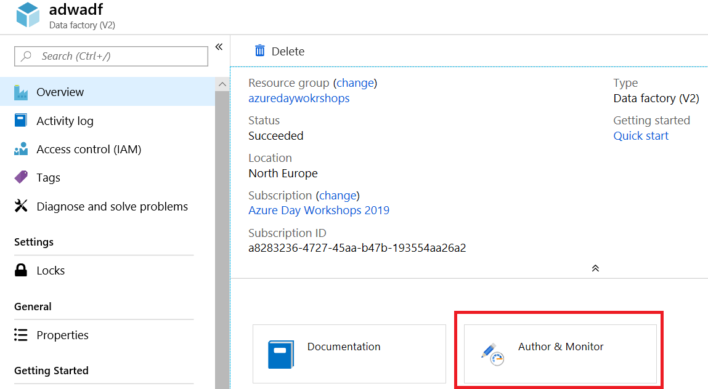

Po wybraniu opcji Authot and Monitor zostaniemy przekierowani do desinger ADF
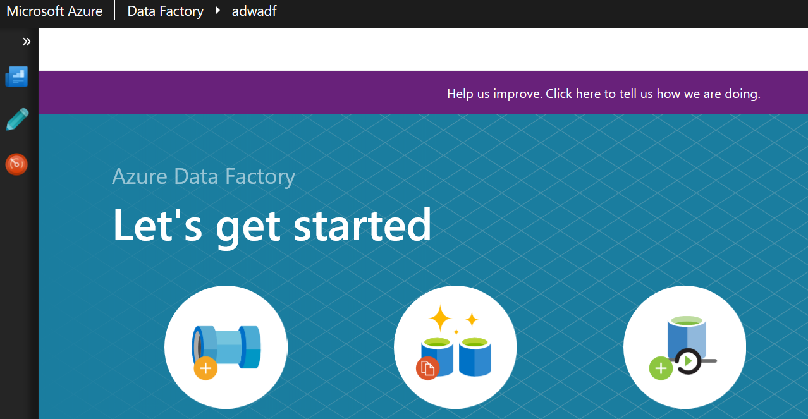
Przy pierwszym uruchomieniu designera zostaniemy poproszeni o skonfigurowanie repozytorium kodu (krok ten jest opcjonalny jeśli, ADF będziemy używać tylko do testów ADF, w przypadku używania ADF niezbędne jest korzystanie z repozytorium.) Więcej informacji na temat integracji z repozytorium kod znajdziemy pod adresem https://azure.microsoft.com/en-us/blog/azure-data-factory-visual-tools-now-supports-github-integration/.

## Modelowanie Pipeline

Aby otworzyć designer pipeline należy użyć opcji Author po lewej stronie menu

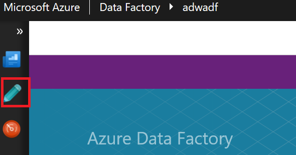

Po uruchomieniu opcji Author otwarty zostanie designer pipeline

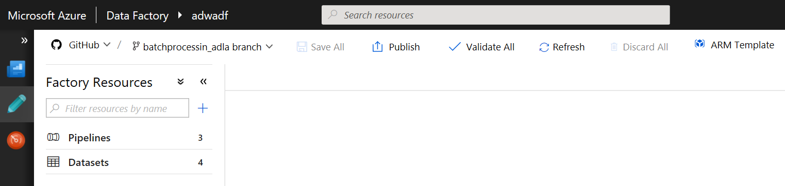

#### Tworzenie połączenia do Azure Data Lake Store i Azure Data Lake Analytics

W poziomu edytora Azure Data Factory przejdź do opcji Connections

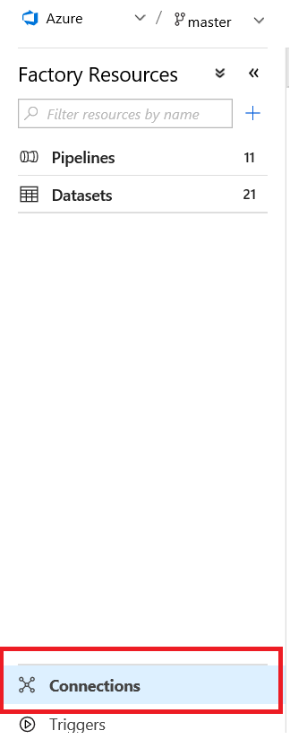

Następnie przejdź do opcji Linked Services i New. Następnie dodaj ADLS Service

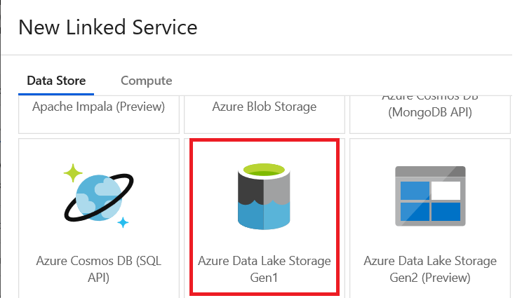

Wybierz usługę ADLS w ramach swojej subskrypcji i korzystając z wcześniej stworzonego Service Principal stwórz Linked Service od usługi Azure Data Lake Store.

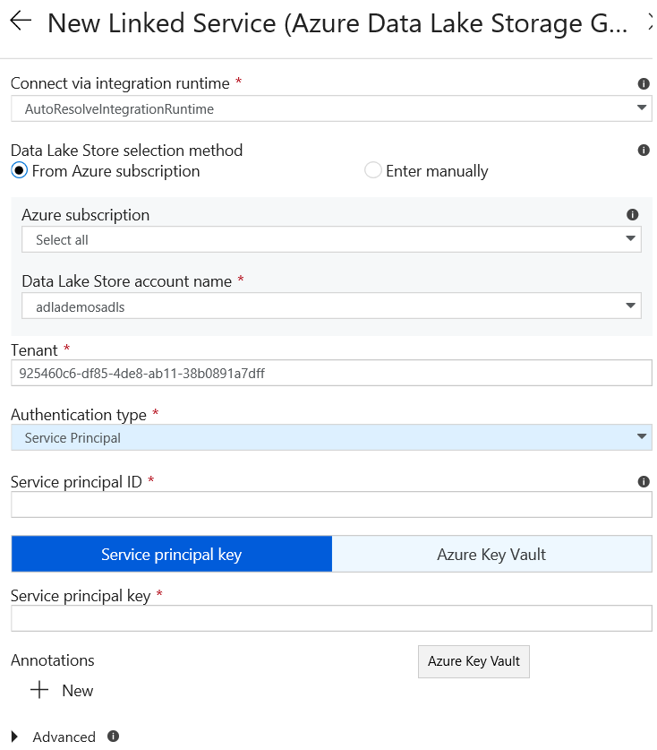

Następnie stwórz Linked Service do Azure Data Lake Analytics (Compute)- lista kroków analogiczna jak w przypadku ADLS.